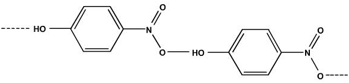
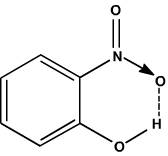

## Theory

  <h2>Steam Distillation:</h2>
  
This technique is used for separating substances which are immiscible with water, volatile in steam, and having high vapour pressure at the boiling temperature of water.

  
  
Consider two immiscible liquids. In the mixture, one liquid cannot mix the properties of the other. So each liquid behaves as if the other is not present. Therefore, each liquid will show its own vapour pressure, but the sum of the vapour pressures will be much higher than the vapour pressures of individual liquids. Hence, the mixture of two immiscible liquids will boil at a lower temperature than their normal boiling points. So this method can be used for purifying liquids with very high boiling points.

  
  
<strong>Example:</strong> Aniline

  
  
If water is used as one of the immiscible liquids, the method is called <strong>steam distillation</strong>. It is also used for purifying liquids which decompose at their normal boiling points.

  
  
<strong>Example:</strong> Glycerol

  
  
Steam distillation is used for separating organic compounds from plant parts.

  
<strong>Examples:</strong> Lemon grass oil, Eucalyptus oil, etc.

  <h2>Intra and Inter Molecular Hydrogen Bonding:</h2>
  
  
<strong>Intra-molecular hydrogen bonding</strong> is present in <em>o-nitrophenol</em>. This is due to the polar nature of the O-H bonds which result in the formation of hydrogen bonds within the same molecule. This intramolecular H-bonding reduces water solubility and increases volatility.

  
  
But in <em>p-nitrophenol</em>, <strong>inter-molecular hydrogen bonding</strong> (between H and O atoms of two different p-nitrophenol molecules) is possible. As a result of inter-molecular hydrogen bonding, p-nitrophenol undergoes association that increases the molecular weight, thereby decreasing volatility. Thus, o-nitrophenol is steam distillable while p-nitrophenol is not.

### Para nitro phenol with inter-molecular hydrogen bonding:

### Ortho nitro phenol with inter molecular hydrogen bonding:

